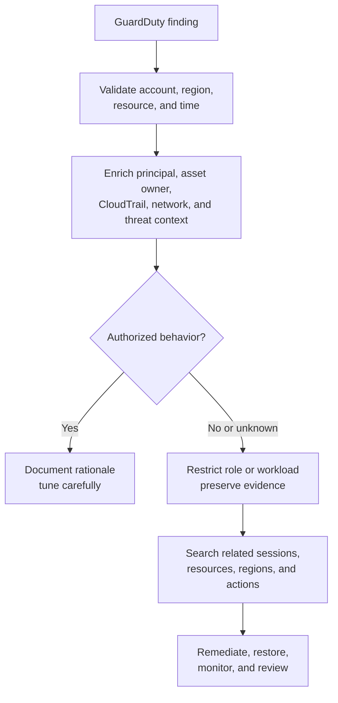

# GuardDuty Finding Triage

**Source:** Independent tabletop exercise  
**Status:** Complete case study

## Scenario

A high-confidence finding reports suspicious API activity from a workload role. The alert is a starting point; the analyst must validate asset criticality, principal context, exposed permissions, and related actions.

## Triage workflow

## Analyst questions

- Is the affected resource expected to be internet-facing?
- What role or credential performed the activity?
- Did the behavior occur in other regions or accounts?
- What actions preceded and followed the alert?
- Did permissions, persistence mechanisms, or logging controls change?
- Could a scanner, deployment system, or approved test explain the activity?

## Containment options

Containment is proportional to confidence and business impact. Options include restricting the role policy, isolating a workload through security-group changes, preserving a disk snapshot, revoking a session path, or quarantining credentials. Destructive action is avoided until evidence and recovery requirements are understood.

## False-positive management

Tuning should use stable context such as approved scanner identities, expected resources, and known maintenance behavior. Broad suppression by finding type or network range can hide real compromises.

## Lessons learned

Effective cloud triage combines the managed finding with raw audit, identity, asset, and network evidence. Severity is influenced by what the principal could do and what actually happened, not only the alert label.
