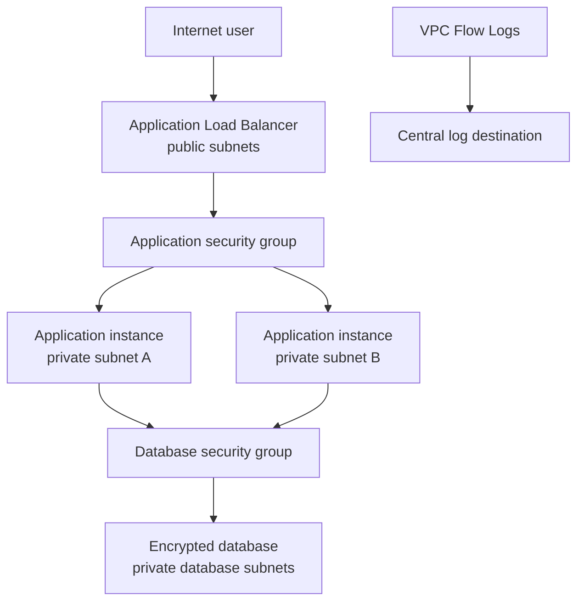

# Secure VPC Design

**Source:** Coursework-derived case study, independently rewritten  
**Status:** Complete design case study

## Architecture

## Network controls

- Only the load balancer receives internet-originated application traffic.
- Application instances accept traffic from the load-balancer security group, not arbitrary addresses.
- The database accepts its service port only from the application security group.
- Administrative access uses a managed access path rather than opening SSH or RDP to the internet.
- Route tables keep application and database tiers nonpublic.
- Flow logs support connection-level investigation but do not capture payloads.

## Validation

| Test | Expected outcome |
|---|---|
| Request through the public load balancer | Application responds |
| Direct request to an application instance | No public path |
| Direct request to the database from the internet | Blocked |
| Application-to-database connection on approved port | Allowed |
| Application-to-database connection on an unapproved port | Blocked and observable in flow logs where configured |

## Threat considerations

Segmentation limits lateral movement but does not make the application trustworthy. Web vulnerabilities, stolen application credentials, dependency compromise, and excessive outbound access still require application controls, secret management, patching, and monitoring.

## Cost and cleanup

NAT gateways, load balancers, public addresses, flow-log destinations, and running compute resources can incur charges. A lab teardown must inventory and remove dependent resources rather than deleting only the instances.
